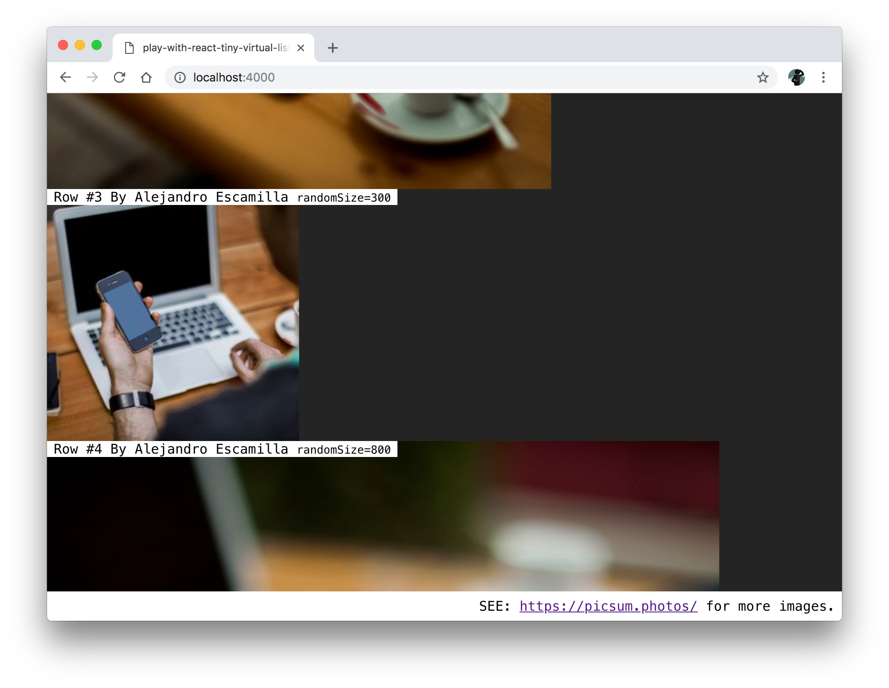

### play-with-react-tiny-virtual-list

Playground repository of random height image list.

Demo: https://subuta.github.io/play-with-react-tiny-virtual-list/



### Included examples.

- `/images` -> Load images with fixed(passed from API) height/width.
- `/pokemons` -> Each row requests Pokemon data at render and load images(Good example for variable height contents).
- `/load-more` -> Scroll up to load more contents with loading component(Good example for variable list length)

### How to develop

```
# Install dependencies
npm i

# Start development server
npm run serve

# Open app (served by `poi`)
open http://localhost:4000

# Build & Serve static assets
npm run servep

# Open app (served by `serve`)
open http://localhost:5000
```